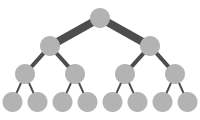
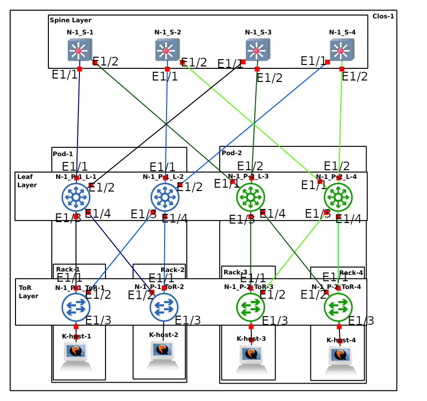
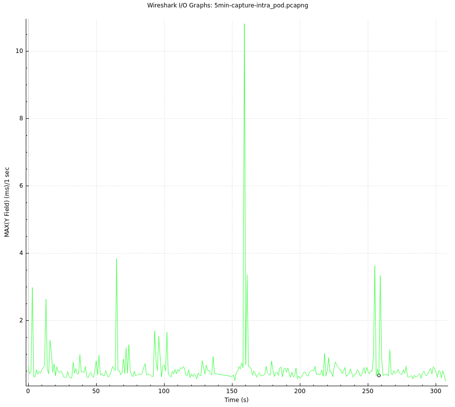
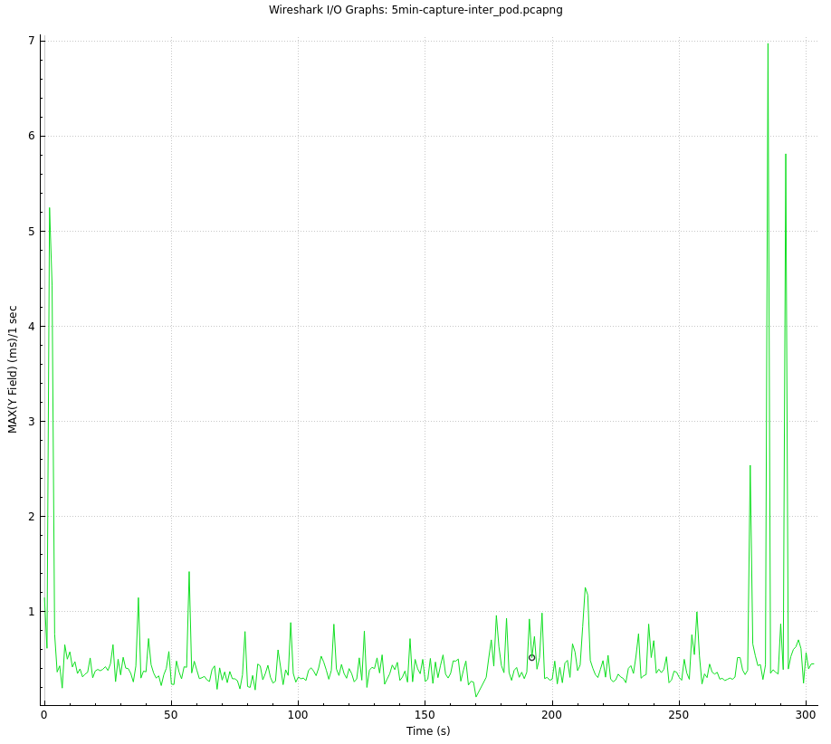

# 
**BGP in the Datacenter**
 
 By Julian Mato-Hernandez & Evan Jurdan 

# Table of Contents:
- [Introduction](#introduction)
- [Technology Used](#technology-used)           
    - [Clos & Fat Tree](#clos--fat-tree) 
    - [BGP & EBGP](#bgp--ebgp)
    - [Full Mesh & Partial Mesh](#full-mesh--partial-mesh)
- [Experements](#experements)
    - [Topology Description and Benefits](#topology-description-and-benefits)
    - [Link Breakage from Spine to Leaf and from Leaf to ToR](#link-breakage-from-spine-to-leaf-and-from-leaf-to-tor---experement)
    - [Inter & Intra Pod Travel Time](#inter--intra-pod-travel-time---experement)
- [Results](#results)
    - [Link Breakage from Spine to Leaf and from Leaf to ToR](#link-breakage-from-spine-to-leaf-and-from-leaf-to-tor---result)
    - [Inter & Intra Pod Travel Time](#inter--intra-pod-travel-time---result)
- [Discussion of results](#discussion-of-results)
- [Critical Summary](#critical-summary)
- [References](#references)
- [Appendix](#appendix)
 
 
 

# Introduction:
This paper will talk about the use of BGP deployed in a Clos topology for use in the data center. BGP or Border Gateway Protocol is a widely used routing protocol due to its stability and its  "capability to support large and complex networks"(Zhang and Bartell, ch.1). To match the scalability of BGP an equally scalable topology must be used, this is where Clos steps in. Clos topology is relatively old being proposed more than 60 years ago and seeing extensive use in telephony and computing. In this paper, we will be using a variant of Clos commonly referred to as "Fat Tree". Fat Tree takes advantage of  Clos network's massive expandability but introduces a strict hierarchy that aids in its deployment and maintenance. In parallel, the hierarchical form of Fat Tree aids in the design, implementation, and operation of BGP by giving it a highly structured network.    

We will begin by taking a more in-depth look at Clos & Fat Tree, BGP & EBGP, along with Full Mesh & Partial Mesh. This will give you the baseline knowledge needed to understand the Experimental portion of the paper. The experimental portion begins with a description of the topology used and a few key tests and the procedure used to run them, followed by the results section which will lay out the results as factually and unbiased as possible. Following will be an interpretation of the data along with a critical look at the claims relative to the data.
 
 
 

# Technology Used:

## Clos & Fat Tree
Fat Tree(A subset of Clos topologies) relies heavily on route aggregation. more specifically as you see in figure 1 each level has a "thicker" connection than the last. Clos and therefore Fat Tree traditionally use a 2 or 3 tiered network structure with the "Spine" being at the top followed by "leafs" and in a 3 tiered Clos a final ToR layer. The Spine acts as the main distribution between otherwise isolated pods of systems. The leafs are the aggregation layer, they collect and truncate traffic from the ToR layer to pass it through to the Spine. Leaf layers are also responsible for any IP Sec or other security measures implemented by the system, this is crucial due to the need to keep the Spine as secure as possible. With the specialized nature of each layer relatively, specific hardware considerations have to be made, the Spine needs relatively few connections but needs massive bandwidth to handle the aggregated leaf layer traffic, leaf layers need a large number of ports to accommodate as many hosts or ToR's with a limited number of high-speed links to the Spine, and finally, the ToR layer only needs a large number of low-speed connections. By having all of your traffic aggregate adding new portions to the network is trivial giving Clos tremendous scalability while remaining structured and organized.

 
 

## BGP & EBGP
BGP "is the routing protocol that glues together the net-works forming the Internet"(Garcia-Martinez and Bagnulo 2432). BGP works on the concept of neighbors, route advertisements, hello timers, and route flooding. To be exact we are using EBGP to simplify our topology, in brief, EBGP advertises and re-advertises routes to all BGP-enabled devices. A neighbor in BGP is simply the next hop or directly adjacent BGP aware device that a BGP device has established trust with, to establish a trust a BGP device must know the device's correct AS or Autonomous System number and the IP address of the connecting link. This is how BGP maintains its isolation from other BGP or malicious networks, without intimate knowledge of the network, not much can be done. Route advertisements are as they sound, when a BGP device wants to share the location of a network directly attached to them they can advertise it to the network thus propagating its location across all BGP routing tables. Hello timers are packets sent from neighbor to neighbor to simply affirm its continued function in the network, normally hello timers are sent at a predefined interval and if ever 3 acknowledgments are missed in a row the network is flooded with a route change. Finally, flooding is the act of propagating information to all systems on the network.
 
 

## Full Mesh & Partial Mesh
Full Mesh is a term to refers to the total interconnection of all nodes in a network as shown in figure 2. This allows for maximum points of redundancy in case of a link failure, for this reason, all the pods in a Clos or Fat Tree topology are interconnected. This is best practice in most networks, though it does bring with it some issues namely loops. A large issue with full mesh is the existence of loops in the network leaving the opportunity for packets to get lost in limbo slowing down the network and eventually crashing the machines tunning it. As to avoid this we have loop avoidance protocols but by adding another protocol to your network you are adding latency, and unfortunately the more links the longer convergence could take as the protocol searches for a new route. this can be mitigated by adding link state costs to narrow the decision tree but if done correctly in a 3 tier Clos topology the redundancy already present at the spine a partial mesh can be used while maintaining redundancy. Partial Mesh as it sounds only connects a portion of the systems together leaving a higher chance of failure unless accounted for though it does alleviate network complexity and convergence time at times.

 
 
 

# Experements:

## Topology Description and Benefits
With our implementation of Clos & Fat Tree, we used 4 Spine routers, another 4 leaf routers 2 for each Pod, 2 racks with 1 ToR router each, and one host per rack. This configuration was chosen due to it being the minimum hardware to showcase and run BGP while retaining a high level of expandability if needed. The IP and AS naming scheme is standardized across the layers starting with the first octet denoting what layer the port is going to, anything with a one is going to the spine and a two is connected to the leaf. Octet two denotes if there is a segmentation such as the pods in the leaf and ToR layers. Octet 3 denotes a second redundant connection if any. And the fourth and last octet denotes the /30 link between two BGP neighbors, /30 was used in this instance due to it only having two host IP addresses making it unfeasible for someone to access the same network as the two neighbors. Along with a hierarchical IP scheme the ASs are also structured. All Spine AS's are a multiple of 25 starting at 0 to keep the first digit unchanged to denote its layer from 1-3, 1 being the spine and 3 being the ToR.              

The hostnames are also telling of position and location in the network, *N* denotes the network, in this case, there is only one, *S* denotes the spine and its number in the spine, *P* is the pod number, *L* designates the leaves and their corresponding number, and finally, *ToR* shows what rack that machine is in. By having such a structured network we can ensure that regardless of scale the network can remain human-readable in case of a future expansion or in the case of maintenance. Finally where it was possible The port numbers for connecting machines match to make diagnostics easier.         

Some benefits to this topology are that in the case of anyone link failure regardless of placement the topology will retain full connectivity once converged, and with key exceptions, the network could withstand two to three link failures with no loss of connectivity. BGP also allows for previously downlinks with a higher score than those currently in use to re-establish themselves as the primary link. BGP's features and this topology design essentially ensure at least one hot standby at all times during peak operation. All in all BGP's route awareness and Clos's expandable and redundant nature create a highly flexible and reliable system.          
 
 

### *Spine*
| Host Name | Interface 1(E1/1) | Mask | Interface 2(E1/2) | Mask | AS | Advertised Network's |
| :--- | ---: | :--- | ---: | :--- | :---: | :--- |
| N-1_S-1 | 1.1.1.1 | /30 | 1.1.1.5 | /30 | 124 | N/A |
| N-1_S-2 | 1.1.1.13 | /30 | 1.1.1.17 | /30 | 149 | N/A |
| N-1_S-3 | 1.1.1.25 | /30 | 1.1.1.29 | /30 | 174 | N/A |
| N-1_S-4 | 1.1.1.37 | /30 | 1.1.1.41 | /30 | 199 | N/A |
 

### *Leaf*
| Host Name | Interface 1(E1/1) | Mask | Interface 2(E1/2) | Mask | Interface 3(E1/3) | Mask | Interface 4(E1/4) | Mask | AS | Advertised Network's |
| :--- | ---: | :--- | ---: | :--- | ---: | :--- | ---: | :--- | :---: | :--- |
| N-1_P-1_L-1 | 1.1.1.2 | /30 | 1.1.1.26 | /30 | 2.1.1.1 | /30 | 2.1.1.5 | /30 | 224 | N/A |
| N-1_P-2_L-2 | 1.1.1.14 | /30 | 1.1.1.38 | /30 | 2.1.1.9 | /30 | 2.1.1.13 | /30 | 249 | N/A |
| N-1_P-1_L-3 | 1.1.1.6 | /30 | 1.1.1.30 | /30 | 2.2.1.1 | /30 | 2.2.1.5 | /30 | 274 | N/A |
| N-1_P-2_L-4 | 1.1.1.18 | /30 | 1.1.1.42 | /30 | 2.2.1.13 | /30 | 2.2.1.9 | /30 | 299 | N/A |  
 

### *ToR*
| Host Name | Interface 1(E1/1) | Mask | Interface 2(E1/2) | Mask | Interface 3(E1/3) | Mask | AS | Advertised Network's |
| :--- | ---: | :--- | ---: | :--- | ---: | :--- | :---: | :--- |
| N-1_P-1_ToR-1 | 2.1.1.2 | /30 | 2.1.1.10 | /30 | 192.1.1.254 | /24 | 324 | 192.1.1.0/24 |
| N-1_P-1_ToR-2 | 2.1.1.14 | /30 | 2.1.1.6 | /30 | 192.1.2.254 | /24 | 349 | 192.1.2.0/24 |
| N-1_P-1_ToR-3 | 2.2.1.2 | /30 | 2.2.1.10 | /30 | 192.2.1.254 | /24 | 374 | 192.2.1.0/24 |
| N-1_P-1_ToR-4 | 2.2.1.14 | /30 | 2.2.1.6 | /30 | 192.2.2.254 | /24 | 399 | 192.2.2.0/24 |             
 

\
 
 

## Link Breakage from Spine to Leaf and from Leaf to ToR - Experement              
One of the main features of a meshed topology and BGP is to be able to re-establish connection after a broken link, so for this experiment, we will be testing that ability. we start by generating large amounts of TCP and UDP traffic from K-Host-1 to K-Host-3 with the help of `nmap -p0-65535 192.2.1.1 -T5` and `nmap -sU -p- 192.2.1.1 -T5`. once the traffic starts to be generated we break a link. To begin with we broke 1.1.1.36/30 5 times followed by breaking link 2.1.1.8/30. K-Host-3 has a Wireshark capture running on it, we log when the traffic stops and when it re-establishes connection and take the difference. Since the hello packet interval is set to 10 seconds and the LSA interval is 32 seconds we should be looking at an average of 31 seconds till convergence.
 
 

## Inter & Intra Pod Travel Time - Experement          
For this experement, we generated 5 minutes worth of traffic and graphed it by tcp.analysis.ack_rtt on wireshark. We did this once from one pod to the other in other words inter pod traffic, then between two hosts in one pod or Intra pod traffic. this will show if there are any performance losses due to the spine.
 
 

# Results:

## Link Breakage from Spine to Leaf and from Leaf to ToR - Result              
         
Now with all the data collected, we can see that our hypothesis was correct, most of the breaks converged in the 30 - 34 second mark regardless of the location of the disconnect. This is a perfect example of the predictability of BGP and its reliability when put together with an appropriate topology.       
             
         

| Location | Time of Disconnect | Time of Re-connect | Convergence Time |
| :--: | :--- | :--- | :---: |
| Convergence 1 Back Bone pod1 → pod2 | 5.70918634 | 37.392604107 | 31.683417767 |
| Convergence 2 Back Bone pod1 → pod2 | 8.366746758 | 42.08428909 | 33.717542332 |
| Convergence 3 Back Bone pod1 → pod2 | 27.817136446 | 62.587803363 | 34.770666917 |
| Convergence 4 Back Bone pod1 → pod2 | 16.702373645 | 47.753583891 | 31.051210246 |
|  |  |  |  |
| Convergence 1 ToR – Leaf pod1 → pod2 | 7.808788712 | 39.638460712 | 31.829672 |
| Convergence 2 ToR – Leaf pod1 → pod2 | 28.27404299 | 61.215558132 | 32.941515142 |
| Convergence 3 ToR – Leaf pod1 → pod2 | 4.204183651 | 34.333676776 | 30.129493125 |
| Convergence 4 ToR – Leaf pod1 → pod2 | 1.983373484 | 36.082755752 | 34.099382268 |

 
 

## Inter & Intra Pod Travel Time - Result          
 
The bellow graphs depict the RTT(Y) of each packet compared to the time it originated(X) of inter and Intra pod traffic. From the data, it looks as though the RTT is relatively even with the exception of some large outliers.
 
 

\
\
 
 

# Discussion of Results:           
The results fell in line with what was expected of BGP and Clos. There were some outliers such as one data point in the convergence time experiment that managed to converge in 25 seconds which should not be possible due to the hello timer being 10 seconds, the conclusion was that there must have been a missed hello timer before the link was broken. Another interesting development is the relatively small impact traveling through the spine has on connection speed, it appears nearly negligible.      
 
With this data, it is easy to see the stability of this network even under a 98000 packet per minute load. Though some of the network degradations are probably attributable to the form of virtualization used for this topology (GNS3 with qemu). 
 
 
 

# Critical Summary:            
There are many advantages to BGP but unfortunately, it has one glaring flaw that was out of the scope of this paper, and that would be its security. The risk of AS leaks and the ease of trace routing a network makes BGP very risky. In a perfect world, the AS numbers would be unacceptable but unfortunately, it is not a question of if but of when.             
 
On top of the security issues, there is a lot of administration and organization needed to deploy BGP on this topology, obviously, in the context of a data center this is trivial but in a small to medium network, this is simply unreasonable. However when feasible this topology and protocol do compliment each other very well. 
 
 
 

# References:          
Dutt, Dinesh. BGP in the Data Center. 1st ed., Van Duuren Media, 2017.          
Zhang, Randy, and Micah Bartell. BGP Design and Implementation. Amsterdam University Press, 2004.           
Camarero, Cristobal, et al. “Random Folded Clos Topologies for Datacenter Networks.” 2017 IEEE International Symposium on High Performance Computer Architecture (HPCA), 2017. Crossref, https://doi.org/10.1109/hpca.2017.26.                  
Garcia-Martinez, Alberto, and Marcelo Bagnulo. “Measuring BGP Route Propagation Times.” IEEE Communications Letters, vol. 23, no. 12, 2019, pp. 2432–36. Crossref, https://doi.org/10.1109/lcomm.2019.2945964.                      

Figure 1 - By Jafet at English Wikipedia - Transferred from en.wikipedia to Commons., Public Domain, https://commons.wikimedia.org/w/index.php?curid=37953156          
Figure 2 - Public Domain, https://commons.wikimedia.org/w/index.php?curid=991408                    
Figure 3 - By Original: FoobazSVG: Rehua - This file was derived from: NetworkTopology-Mesh.png, Public Domain, https://commons.wikimedia.org/w/index.php?curid=31012050

 
 

# Appendix:            
<dl>
   <dt>LSA</dt>
       <dd>Link State Advertisement</dd> 
   <dt>Clos</dt>
       <dd>A type of datacenter topology</dd> 
   <dt>Fat Tree</dt>
       <dd>A type of Clos topology</dd> 
   <dt>BGP</dt>
       <dd>Border Gateway Protocol</dd> 
   <dt>EBGP</dt>
       <dd>External Border Gateway Protocol</dd> 
   <dt>Full Mesh</dt>
       <dd>When all nodes in a network are interconnected</dd> 
   <dt>Partial mesh</dt>
       <dd>When only some nodes in a network are interconnected/dd>
   <dt>topology</dt>
       <dd>how to refer to the physical structure of a network</dd> 
   <dt>spine</dt>
       <dd>The top layer of a Clos topology</dd> 
   <dt>leaf</dt>
       <dd>The middle or "aggregation" layer of a Clos topology</dd> 
   <dt>ToR</dt>
       <dd>Top of Rack in a Clos topology</dd> 
   <dt>pod</dt>
       <dd>Point of delivery</dd> 
   <dt>link</dt>
       <dd>Connection between two machines</dd> 
   <dt>Routing protocol</dt>
       <dd>The software that fairies data over a network</dd> 
   <dt>Inter</dt>
       <dd>Between two things</dd> 
   <dt>Intra</dt>
       <dd>Within itself</dd> 
   <dt>route aggregation</dt>
       <dd>The act of making many small individual routes converge in to one route</dd> 
   <dt>truncate</dt>
       <dd>limit the number of</dd> 
   <dt>IP Sec</dt>
       <dd>Internet protocol security</dd> 
   <dt>bandwidth </dt>
       <dd>measure of the data transfer rate or capacity of a given network</dd> 
   <dt>aggregated</dt>
       <dd>To make one</dd> 
   <dt>hosts</dt>
       <dd>Computers on the network</dd> 
   <dt>neighbors</dt>
       <dd>The router or layer 3 switch directly adjacent</dd> 
   <dt>route advertisements </dt>
       <dd>the way BGP states what networks it is aware of</dd> 
   <dt>hello timer</dt>
       <dd>Protocol to ensure all nodes in a BGP network are functioning</dd> 
   <dt>route flooding</dt>
       <dd>The act of receiving saving and repeating a message</dd> 
   <dt>AS</dt>
       <dd>Autonomous System</dd> 
   <dt>Autonomous System Number</dt>
       <dd>A unique identifier for each router or layer 3 switch</dd> 
   <dt>propagating</dt>
       <dd>replicateing</dd> 
   <dt>route change</dt>
       <dd>when the flow of traffic changes</dd> 
   <dt>redundancy</dt>
       <dd>Secondary or contingent systems</dd> 
   <dt>convergence time</dt>
       <dd>The time from a lost link to re-establishing connection</dd> 
   <dt>octet </dt>
       <dd>one 8 bit quarter of an IPv4 address</dd> 
   <dt>/30</dt>
       <dd>a subnet with only 4 addresses and 2 usable ones</dd> 
   <dt>hostname</dt>
       <dd>the name of the machine</dd> 
   <dt>downlinks</dt>
       <dd>Network connections who are no longer passing traffic</dd> 
   <dt>hot standby</dt>
       <dd>A machine which is idling for the purpose of taking over if there the primary fails</dd> 
   <dt>wireshark</dt>
       <dd>A packet capturing software</dd> 
   <dt>capture</dt>
       <dd>log incoming and outgoing traffic</dd> 
   <dt>traffic</dt>
       <dd>Data moving in a network</dd> 
   <dt>GNS3</dt>
       <dd>Network emulation software</dd> 
   <dt>qemu</dt>
       <dd>virtualization software</dd> 
<dl>

